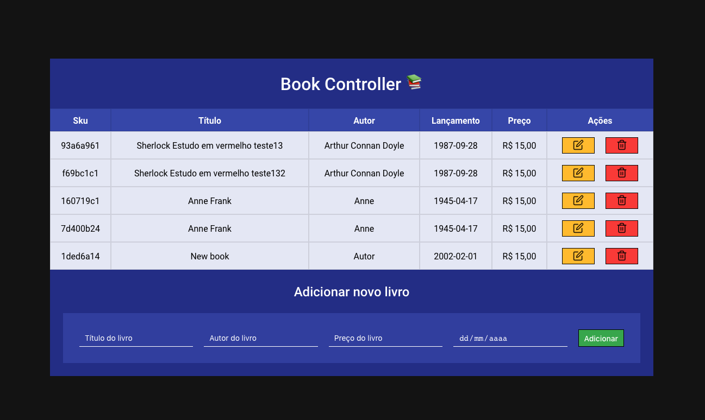

# Books-Controller
Gerenciador de livros 📚

## 🚀 Tecnologias usadas
* ReactJs
* Styled Components
* Express
* Mongoose

## 🤔 Como utilizar
* Abra o terminal
* Rode o comando npm install nas pastas frontend e backend
* E pra finalizar rode o comando npm start em ambas as pastas

